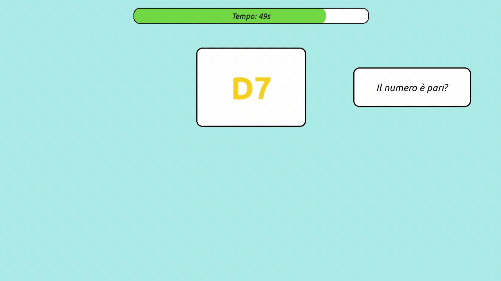
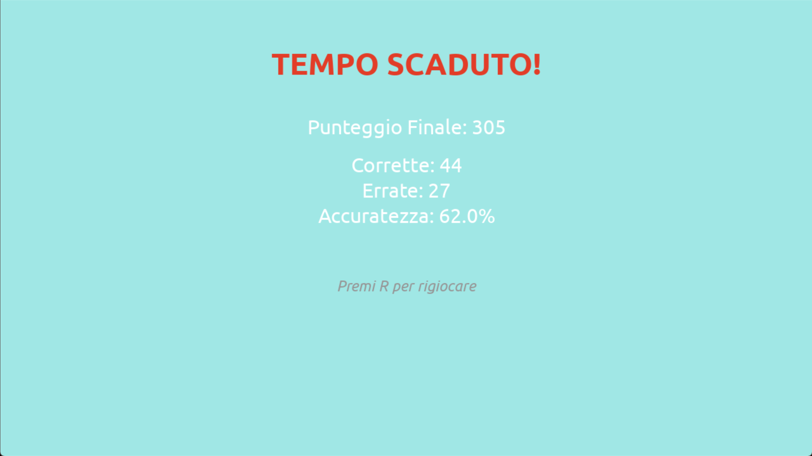

# Brain Shift — progetto di gruppo

## Chi siamo

- Mattia Binatti — binattimattia@gmail.com / @binattimattia
- Jason Mezzadri — mezzadrijason@gmail.com / @JasonMezzadri

Istituto Tecnico IIS JC Maxwell — Classe 4A Informatica — a.s. 2025-26

## Cos'è Brain Shift

**Brain Shift** è un frenetico gioco di *rapid task-switching* progettato per testare i tuoi riflessi mentali. Ad ogni turno apparirà sullo schermo una carta contenente una lettera e un numero. La sfida sta nel fatto che la regola per rispondere cambia continuamente in base alla posizione della carta:
- Se la carta appare in **alto**, devi chiederti: *"Il numero è pari?"*
- Se la carta appare in **basso**, devi chiederti: *"La lettera è una vocale?"*

Hai 60 secondi per adattarti ai continui cambi di regola e totalizzare il punteggio più alto possibile!

## Come giocare

Istruzioni per avviare il gioco da clone pulito:

```bash
git clone https://github.com/binattimattia/BrainShift-BinattiMezzadri.git

cd BrainShift-BinattiMezzadri

python -m venv venv

# Su Windows:
venv\Scripts\activate
# Su macOS/Linux:
source venv/bin/activate

pip install -r requirements.txt

python main.py
```

- versione Python richiesta Python 3.11+ (la versione 3.14 non è ancora supportata da pygame)
- versione pygame richiesta pygame==2.6.1
- versione pytest richiesta pytest==8.4.2

## Controlli

- ← freccia sinistra: Risposta falsa
- → freccia destra: Risposta vera
- ESC: Chiude il gioco
- X sulla finestra: Chiude il gioco
- R: Riavvia la partita (solo quando finisce la partita)

## Preview del gioco





## Struttura del repository

L'architettura del progetto segue il paradigma Model-View-Controller (MVC):

```text
BrainShift-BinattiMezzadri/
├── main.py           ← (Controller) Entry point, gestione degli eventi e ciclo vitale
├── config.py         ← Costanti, colori, dimensioni finestra e bilanciamento
├── models.py         ← (Model) Strutture dei dati tramite dataclass (Trial)
├── rules.py          ← (Model) Logica pura delle regole e risposta attesa
├── scoring.py        ← (Model) Modulo di attribuzione punteggi per risposte
├── generator.py      ← Motore casuale di generazione dei Trial
├── ui.py             ← (View) Rendering a schermo di Carte, Timer, Testi e Menu
├── fonts/            ← Asset grafici (font TrueType)
├── docs/             ← Documentazione tecnica del progetto e Devlog
└── tests/            ← Test Unitari (pytest) per verificare il core engine
```

## Documentazione

Tutti i dettagli tecnici sulle implementazioni e lo sviluppo sono consultabili nei seguenti file:
- [Architettura del progetto](docs/architettura.md)
- [Scelte Tecniche](docs/scelte.md)
- [Devlog (Diario di Sviluppo)](docs/devlog.md)

## Come lanciare i test

```bash
python -m pytest tests/test_rules.py
```
