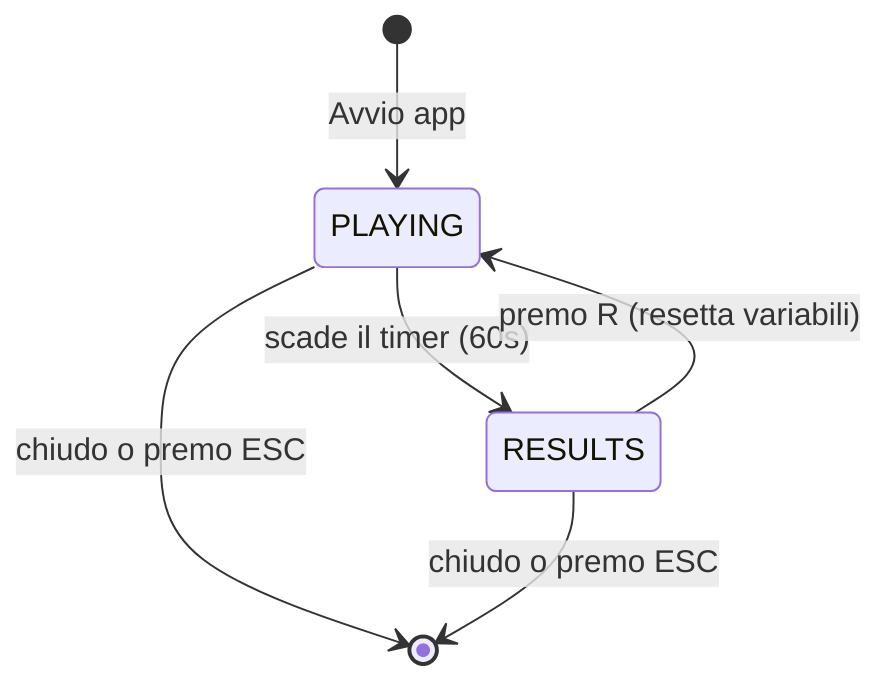
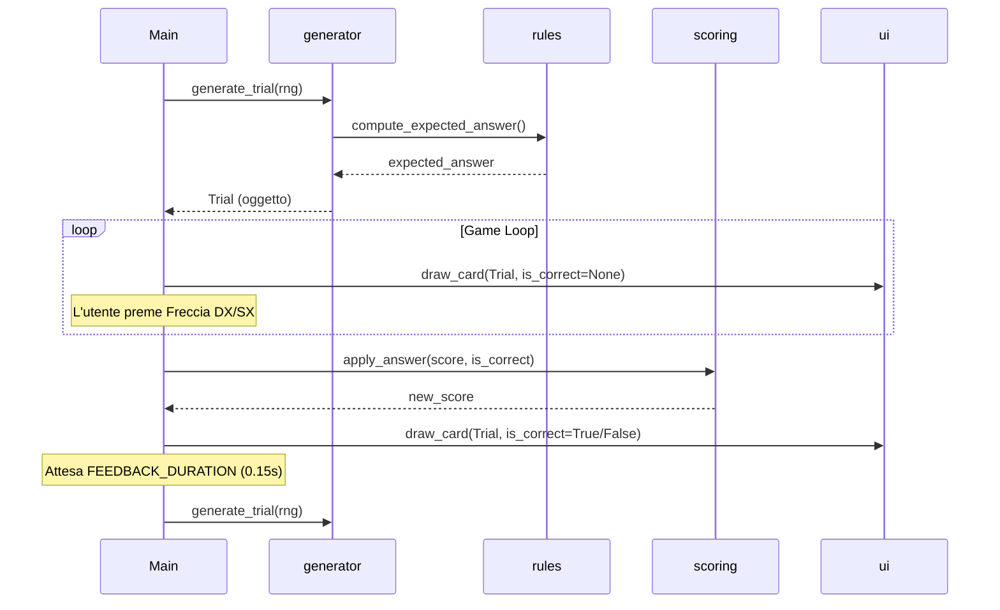

# Architettura

## Decomposizione in moduli

- `main.py` — Entry point e game loop principale; gestisce lo stato generale, il flusso temporale e l'input.
- `config.py` — Centralizza tutte le costanti (colori, dimensioni schermo, parametri di punteggio, seed).
- `models.py` — Contiene le definizioni delle strutture dati di base tramite `dataclass` (es. `Trial`).
- `rules.py` — Modulo puro che incapsula la logica delle regole di gioco (controllo vocali e numeri pari).
- `scoring.py` — Modulo puro che determina l'aggiornamento del punteggio.
- `generator.py` — Gestisce la creazione pseudocasuale dei Trial basandosi sulle regole.
- `ui.py` — Modulo interamente dedicato al rendering (disegno di carte, timer e testi con Pygame).

**Note sui moduli rimossi/modificati**: Non abbiamo utilizzato un modulo `states.py` dedicato. Avendo mantenuto un numero ristretto di stati (solo `PLAYING` e `RESULTS`), abbiamo preferito gestire le transizioni direttamente nel game loop di `main.py` tramite una semplice stringa per evitare di complicare il progetto inutilmente.

## Separazione logica / presentazione

Abbiamo isolato la logica in **moduli "puri"** che non hanno alcuna dipendenza da `pygame`. Questi sono `rules.py`, `scoring.py`, `generator.py` e `models.py`. Possono essere testati e chiamati in qualsiasi contesto Python standard.
Al contrario, **`ui.py` è il modulo dedicato al rendering**. Prende in input le informazioni di stato e dati puri (come le istanze di `Trial` o i secondi rimanenti) e disegna a schermo le forme geometriche e i testi.
Il `main.py` funge da **Controller**: cattura l'input dall'utente, invoca i moduli puri per l'aggiornamento logico e, infine, passa i dati aggiornati ad `ui.py` per la visualizzazione.

## Macchina a stati

Diagramma della macchina a stati:

- **PLAYING**: Stato in cui si svolge l'azione di gioco. Disegna il timer, le istruzioni (se applicabile) e la carta a schermo (mostrando anche il feedback cromatico per 0.15s). Ascolta gli input delle frecce (Destra/Sinistra) per rispondere, ed ESC per uscire.
- **RESULTS**: Stato di fine sessione. Disegna le statistiche (punteggio finale, risposte giuste/sbagliate e accuratezza). Ascolta il tasto `R` per riavviare una nuova partita azzerando timer e contatori, e il tasto ESC per chiudere.

## Flusso di un trial

Descrizione del ciclo di vita:
1. In `main.py` viene chiamato `generate_trial(rng)` per ottenere un nuovo Trial.
2. In `generator.py`, posizioni, lettere e numeri sono scelti casualmente. Il generatore invoca `compute_expected_answer` (`rules.py`) per stabilire la risposta corretta.
3. Il `Trial` è ritornato al `main.py` e visualizzato da `ui.py` finché l'utente non preme una freccia.
4. Premuta la freccia, in `main.py` si confronta l'input con `expected_answer`.
5. Si calcola il nuovo punteggio con `apply_answer` in `scoring.py`.
6. Si setta `feedback_until` e `ui.py` colora la carta di rosso/verde per `0.15` secondi.
7. Al termine del tempo di feedback, si rigenera un nuovo `Trial`.

## Dati principali

Al momento utilizziamo una singola `dataclass` esplicita:
- **`Trial`**: Si trova in `models.py` e contiene la posizione (TOP/BOTTOM), lettera, numero e la risposta attesa. Viene creata da `generator.py` ed è in sola lettura.

## Scoring: come è implementato

Il sistema di punteggio è volutamente basico, definito come funzione pura in `scoring.py`. Non utilizza moltiplicatori o "meter". Alla pressione di un tasto, se la risposta è corretta vengono sommati punti prefissati (`POINTS_CORRECT`); se è errata, vengono sottratti punti (`POINTS_WRONG`). Il minimo è sempre bloccato a 0 tramite la funzione `max(0, new_score)`.

## Generatore: bilanciamento e seed

- **Seed**: Usiamo un generatore isolato `rng = random.Random(SEED)` dove `SEED` è definito in `config.py`. Questo garantisce riproducibilità nelle prove e semplicità di testing.
- **Bilanciamento**: Come specificato in `scelte.md`, ci affidiamo interamente alla casualità per le lettere e i numeri e anche per evitare streak. Non abbiamo implementato controlli rigorosi per bilanciare YES/NO o le ripetizioni prolungate.

## Fading istruzioni

Abbiamo implementato un fading progressivo basato sull'opacità (`alpha`). La variabile `correct_answers` vive in `main.py` (Controller) e viene costantemente passata alla funzione `draw_rules()` di `ui.py`.
Dal punto di vista tecnico, il modulo di view applica dei livelli di trasparenza hardcoded in una tabella (100%, 70%, 40%, 0%). Poiché `pygame` non può applicare trasparenze dirette e primitive geometriche in modo standard su schermi normali, creiamo ad ogni frame una `pygame.Surface` temporanea con il flag `SRCALPHA`, vi disegniamo sopra e applichiamo l'opacità con `set_alpha()`, prima di copiare (blit) questa superficie sullo schermo principale. Oltre le 11 risposte corrette l'opacità scende allo 0% e la renderizzazione viene bloccata del tutto con un early-return per salvare risorse grafiche.

